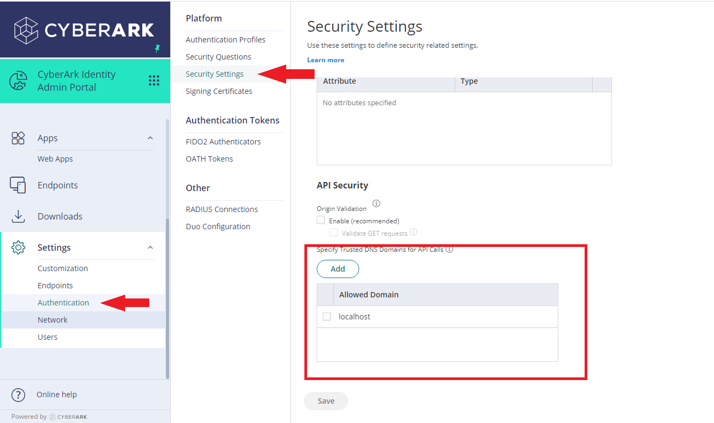

# Login Widget Demo
**Status**: Community

The Login Widget Demo is available with a Community Certification Level.
Naming and API's are still subject to *breaking* changes.


Sample node.js web application to demonstrate the usage of CyberArk Identity Login Widget


# Contents
<!-- MarkdownTOC -->
- [Login Widget Demo](#login-widget-demo)
- [Contents](#contents)
- [Setup](#setup)
	- [Prerequisite](#prerequisite)
	- [Web App Configuration](#web-app-configuration)
		- [Tenant Details in Code](#tenant-details-in-code)
		- [Integration Steps with CyberArk Identity Server](#integration-steps-with-cyberark-identity-server)
	- [Start Web Application](#start-web-application)
	- [Code Maintainers](#code-maintainers)
	- [License](#license)
<a id="web-app-setup"></a>
# Setup
<a id="prerequisites-to-understand-web-application"></a>
## Prerequisite

* NodeJS (https://nodejs.org/en/download/)
<a id="setup-web-application"></a>
## Web App Configuration
<a id="tenant-details-setup"></a>
### Tenant Details in Code
* Replace <TENANT_API_FQDN> in 'LoginWidget.html' with your tenant FQDN (Example : When the tenant url is 'https://abc0123.my.idaptive.app' then TENANT_API_FQDN will be 'abc0123.my.idaptive.app')
* Replace <TENANT_URL> in 'server.js' with actual tenant url (Example: 'https://abc0123.my.idaptive.app')

<a id="integration-steps-with-cyberark-identity-server"></a>
### Integration Steps with CyberArk Identity Server
* Login into the CyberArk Identity Admin Portal.
* Navigate to Settings -> Authentication -> Security Settings.
* In **API security section**, add **localhost** to make it as a trusted domain.
   -  

<a id="start-web-application"></a>
## Start Web Application
Open Command Prompt in working directory and execute the below command to start the application

```console
npm install
node server.js
```
Open http://localhost:5000 in the browser to interact with CyberArk Identity Login Widget

## Code Maintainers

CyberArk Identity Team

<a id="license"></a>
## License

This project is licensed under Apache License 2.0 - see [`LICENSE`](../LICENSE) for more details.

Copyright (c) 2021 CyberArk Software Ltd. All rights reserved.
