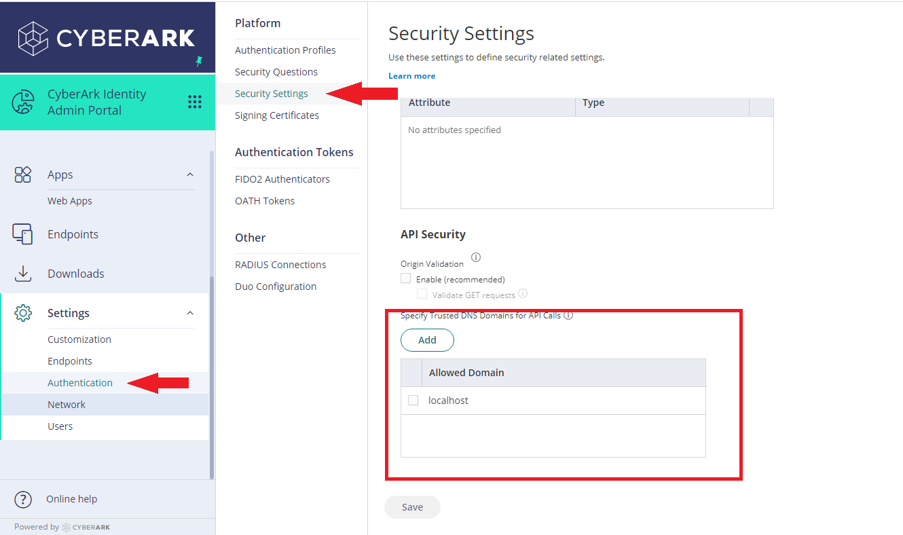

# Login Widget Demo
**Status**: Community

The Login Widget Demo is available with a Community Certification Level.
Naming and API's are still subject to *breaking* changes.


Sample node.js web application to demonstrate the usage of CyberArk Identity Login Widget


# Contents
<!-- MarkdownTOC -->
- [Setup](#web-app-setup)
    - [Prerequisite](#prerequisites-to-understand-web-application)
	- [Web App Configuration](#setup-web-application)
		- [Tenant Details in Code](#tenant-details-setup)
		- [Integration Steps with CyberArk Identity Server](#integration-steps-with-cyberark-identity-server)
	- [Start Web Application](#start-web-application)
- [License](#license)
<a id="web-app-setup"></a>
# Setup
<a id="prerequisites-to-understand-web-application"></a>
## Prerequisite

* NodeJS (https://nodejs.org/en/download/)
<a id="setup-web-application"></a>
## Web App Configuration
<a id="tenant-details-setup"></a>
### Tenant Details in Code
* Replace <TENANT_API_FQDN> in 'LoginWidget.html' with your tenant FQDN (Example : if ur tenant url is 'https://abc0123.my.idaptive.app' then FQDN is 'abc0123.my.idaptive.app')
* Replace <TENANT_URL> in 'server.js' with your tenant url

<a id="integration-steps-with-cyberark-identity-server"></a>
### Integration Steps with CyberArk Identity Server
* Login into the CyberArk Identity Admin Portal 
   -  

<a id="start-web-application"></a>
## Start Web Application(Commands to start the application)
Open Command Prompt in working directory

```console
npm install
node serve.js
```
Open http://localhost:5000 in the browser to interact with Cyberark Identity Login Widget

## Code Maintainers

Cyberark Identity Team

<a id="license"></a>
## License

This project is licensed under Apache - see [`LICENSE`](LICENSE) for more details.
